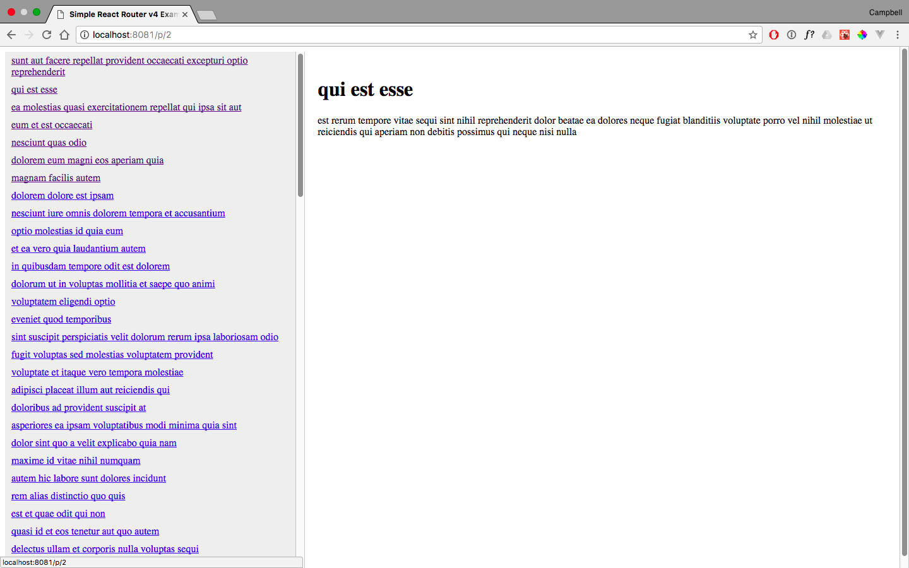

# React Router v4 Routing Example Application

## Introduction

This app was built using React and React Router v4. It fetches posts from [JSONPlaceholder](https://jsonplaceholder.typicode.com/) and displays them in a simple Master/Detail pattern. This app was created because previous examples using React Router v4 have used the router in a single place on the page. The challenge was to see whether a master list of links could change the display within a separate component whilst keeping the routing intact.

## Resources

Thankfully, there are resources online detailing such cases. They are listed here:

- [React Router Introduction](https://www.youtube.com/watch?v=a4kqMQorcnE) by Ryan Florence.
- [Universal Javascript Apps with React Router 4](https://ebaytech.berlin/universal-web-apps-with-react-router-4-15002bb30ccb) by Patrick Hund.
- [A Simple React Router v4 Tutorial](https://medium.com/@pshrmn/a-simple-react-router-v4-tutorial-7f23ff27adf) by Paul Sherman.